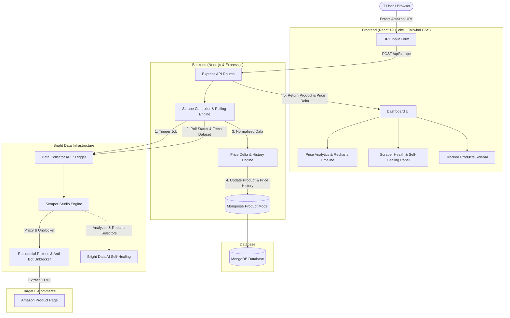

# PriceWatch AI

> **Automated Amazon Product Price Tracking & History Dashboard powered by Bright Data Scraper Studio & MongoDB**

Built for the **Into the Scrape-Verse Hackathon** presented by **WeMakeDevs** and **Bright Data**.

---

## 📌 Problem

E-commerce prices on platforms like Amazon fluctuate frequently due to dynamic pricing algorithms, flash sales, inventory shifts, and regional promotions. Consumers and market researchers struggle to:

1. **Track Price Drops Reliably**: Manually checking product pages is tedious, inconsistent, and impractical for multiple items.
2. **Overcome Scraper Fragility**: Traditional web scrapers break constantly due to dynamic JavaScript rendering, anti-bot mechanisms, IP blocks, and frequent DOM/CSS selector updates.
3. **Maintain Scraping Pipelines**: When target e-commerce layouts change, engineers often spend excessive time debugging selector drift and rewriting scraper logic instead of building user-facing features.

---

## 💡 Solution

**PriceWatch AI** delivers a resilient end-to-end product tracking application:

- **Managed Scraping via Bright Data Scraper Studio**: Offloads proxy rotation, anti-bot handling, and browser automation to Bright Data's Data Collector infrastructure.
- **Scraper Studio Self-Healing**: Leverages Bright Data's AI-assisted Self-Healing to detect and repair broken selectors without modifying backend application code.
- **Price History Persistence**: Ingests structured product data into MongoDB, creating a historical record of price movements over time.
- **Intelligent Price Analytics**: Instantly calculates price deltas, percentage changes, and movement directions (`Increased`, `Decreased`, `Unchanged`, `Initial`).
- **Interactive React Dashboard**: Presents real-time scrape triggers, historical Recharts timelines, product specifications, and collector health diagnostics in a modern dark-mode UI.

---

## ✨ Features

- **On-Demand Live Scraping**: Paste any Amazon product URL to trigger a collection job via Bright Data DCA API with asynchronous polling and status handling.
- **Price Delta Analytics**: Automatically evaluates current price against the previous recorded price to surface price changes (`+` / `-` percentage, absolute price difference).
- **Price History Timeline**: Interactive line chart visualization (powered by Recharts) plotting price variations over time for each tracked item.
- **Tracked Product Library**: MongoDB-backed catalog storing product metadata, ratings, review counts, availability, discount badges, and timestamped history.
- **Scraper Health & Resilience Panel**: Visible dashboard section displaying custom scraper metadata, provider status, and verified self-healing audit logs.
- **Modern Responsive Design**: Glassmorphic UI crafted with React 19, Vite, Tailwind CSS v4, and Lucide React icons.

---

## 🛠️ How Bright Data Scraper Studio is Used

PriceWatch AI integrates with **Bright Data Scraper Studio** to reliably extract structured Amazon product information:

1. **Custom Scraper Studio Collector**: A custom scraper (`Amazon Product Scraper`) was created in Bright Data Scraper Studio with extraction logic for product titles, brand names, prices, discounts, ratings, reviews, and availability.
2. **Triggering Collection (`POST /dca/trigger`)**: When a user submits an Amazon product URL, the Express backend sends an authenticated request to Bright Data's Data Collector API with the target URL:
   ```text
   POST https://api.brightdata.com/dca/trigger?collector=COLLECTOR_ID
   ```
3. **Asynchronous Job Polling (`GET /dca/dataset`)**: The backend receives a collection job ID (`response_id` / `collection_id`) and polls Bright Data's dataset endpoint:
   ```text
   GET https://api.brightdata.com/dca/dataset?id=JOB_ID
   ```
   The backend inspects job statuses (`collecting`, `building`, `running`, `processing`) with exponential backoff handling until the final structured dataset is ready.
4. **Data Normalization & Ingestion**: The returned structured JSON payload is parsed, cleaned, and ingested into MongoDB with price history timestamps.

---

## 🛡️ Self-Healing Demonstration

During development, a real **Self-Healing** scenario was executed and verified using **Bright Data Scraper Studio's Self-Healing** capabilities:

```
[Baseline Working Scraper] ──▶ [Intentional Selector Modification] ──▶ [Scraper Failure / Timeout]
                                                                               │
[Verified Extraction] ◀── [Accept & Apply Repair] ◀── [AI Analysis & Repair] ◀─┘
```

### Step-by-Step Breakdown:

1. **Baseline Operation**: The Amazon product scraper operated normally, accurately extracting title, pricing, and metadata.
2. **Selector Drift Introduced**: The product title CSS selector was intentionally modified to an invalid/non-existent selector in Scraper Studio.
3. **Failure Detected**: On the subsequent scraper run, the scraper timed out waiting for the invalid selector.
4. **Self-Healing Analysis**: Bright Data Scraper Studio's Self-Healing engine analyzed the failed scraper run and inspected the target page DOM structure.
5. **Repair Proposal Generated**: Scraper Studio identified the discrepancy and generated a corrected, resilient selector for the product title.
6. **Repair Accepted & Applied**: The proposed repair was accepted in Scraper Studio and deployed to the active collector.
7. **Verification & Success**: A new scrape was initiated with the repaired collector, successfully extracting product data and restoring normal operation.

> [!NOTE]
> **Technical Clarification**: Self-healing is performed and managed within **Bright Data Scraper Studio's** cloud platform. It is not an automated internal routine executed by our Express backend server.

---

## 🏗️ Architecture Diagram



---

## 💻 Tech Stack

### Frontend
- **Framework**: [React 19](https://react.dev/) + [Vite](https://vite.dev/)
- **Styling**: [Tailwind CSS v4](https://tailwindcss.com/)
- **Charts**: [Recharts](https://recharts.org/)
- **Icons**: [Lucide React](https://lucide.dev/)
- **HTTP Client**: [Axios](https://axios-http.com/)

### Backend
- **Runtime**: [Node.js](https://nodejs.org/) (v18+)
- **Server Framework**: [Express.js](https://expressjs.com/)
- **Database ODM**: [Mongoose](https://mongoosejs.com/)
- **Middleware**: `cors`, `dotenv`

### Database & Scraping Provider
- **Database**: [MongoDB](https://www.mongodb.com/) (Local or Atlas)
- **Scraping Infrastructure**: [Bright Data Scraper Studio & DCA API](https://brightdata.com/)

---

## 📁 Project Structure

```text
pricewatch-ai-scraper/
├── backend/
│   ├── models/
│   │   └── Product.js              # Mongoose schema for products & price history
│   ├── .env.example                # Sample environment template (no secrets)
│   ├── package.json                # Backend Node.js dependencies
│   └── server.js                   # Express application, routes & Bright Data polling
├── frontend/
│   ├── public/                     # Static assets
│   ├── src/
│   │   ├── api/
│   │   │   └── config.js           # Centralized Axios API service layer
│   │   ├── components/
│   │   │   ├── Header.jsx          # Dashboard top navigation bar
│   │   │   ├── ScrapeForm.jsx      # Amazon URL submission form
│   │   │   ├── ScraperHealth.jsx   # Scraper status & verified self-healing card
│   │   │   ├── ProductCard.jsx     # Selected product metadata & badge display
│   │   │   ├── PriceChangeCard.jsx # Price difference & direction analytics
│   │   │   ├── PriceHistoryChart.jsx # Recharts interactive price history chart
│   │   │   └── ProductList.jsx     # Tracked products sidebar list
│   │   ├── App.css                 # Supplemental styling
│   │   ├── App.jsx                 # Main application layout & state management
│   │   ├── index.css               # Tailwind CSS directives
│   │   └── main.jsx                # React DOM entrypoint
│   ├── index.html                  # HTML template
│   ├── package.json                # Frontend React & Vite dependencies
│   └── vite.config.js              # Vite dev server & proxy settings
├── .gitignore                      # Git ignore rules for node_modules, .env, etc.
└── README.md                       # Project documentation
```

---

## 🚀 Setup Instructions

### Prerequisites
- [Node.js](https://nodejs.org/) (v18 or higher)
- [MongoDB](https://www.mongodb.com/) running locally (`mongodb://127.0.0.1:27017`) or a MongoDB Atlas connection string
- A **Bright Data** account with API credentials and a custom Scraper Studio collector

---

### 1. Clone Repository

```bash
git clone https://github.com/your-username/pricewatch-ai-scraper.git
cd pricewatch-ai-scraper
```

---

### 2. Backend Setup

```bash
# Navigate to backend directory
cd backend

# Install dependencies
npm install

# Create your private .env file from the template
cp .env.example .env
```

Configure your `backend/.env` file:

```env
PORT=5000
MONGODB_URI=mongodb://127.0.0.1:27017/pricewatch
BRIGHT_DATA_API_KEY=your_actual_bright_data_api_key_here
BRIGHT_DATA_COLLECTOR_ID=your_collector_id_here
```

Start the backend server:

```bash
npm start
# Express server starts at http://localhost:5000
```

---

### 3. Frontend Setup

In a new terminal window:

```bash
# Navigate to frontend directory
cd frontend

# Install dependencies
npm install

# Start Vite development server
npm run dev
# Dashboard launches at http://localhost:5173
```

---

## ⚙️ Environment Variables

### `.env.example`

Create a `.env` file in the `backend/` directory using the structure below:

```env
PORT=5000
MONGODB_URI=mongodb://127.0.0.1:27017/pricewatch
BRIGHT_DATA_API_KEY=
BRIGHT_DATA_COLLECTOR_ID=
```

| Variable | Description | Example |
| :--- | :--- | :--- |
| `PORT` | Port for the Express backend server | `5000` |
| `MONGODB_URI` | Connection URI for MongoDB database | `mongodb://127.0.0.1:27017/pricewatch` |
| `BRIGHT_DATA_API_KEY` | Bright Data account API authentication key | `Bearer token string` |
| `BRIGHT_DATA_COLLECTOR_ID` | Collector ID from Bright Data Scraper Studio | `c_mt0gyz9d11g1yi8p98` |

---

## 🔌 API Endpoints

| Method | Endpoint | Description | Request Body / Params |
| :--- | :--- | :--- | :--- |
| `GET` | `/api/health` | Service health & database connectivity check | None |
| `POST` | `/api/scrape` | Trigger Bright Data scraper for an Amazon URL | `{ "url": "https://amzn.in/d/..." }` |
| `GET` | `/api/products` | Retrieve all tracked products from MongoDB | None |
| `GET` | `/api/products/:id` | Fetch product details and full price history by ID | `id` (MongoDB ObjectId) |

---

## 📄 Example Structured Scraper Output

When Bright Data Scraper Studio extracts a product, the normalized payload structured by the backend follows this format:

```json
{
  "productUrl": "https://www.amazon.in/dp/B0BDK62PDX",
  "productTitle": "Apple iPhone 14 (128 GB) - Midnight",
  "brand": "Apple",
  "currentPrice": 56999,
  "currency": "INR",
  "originalPrice": 69900,
  "discount": "18%",
  "rating": 4.5,
  "reviewCount": 12480,
  "availability": "In stock",
  "priceHistory": [
    {
      "price": 58999,
      "currency": "INR",
      "timestamp": "2026-08-18T10:15:30.000Z"
    },
    {
      "price": 56999,
      "currency": "INR",
      "timestamp": "2026-08-20T08:45:12.000Z"
    }
  ]
}
```

---

## 📊 Price Tracking Logic

1. **Initial Scrape**:
   - If the product URL is new to the database, a new document is inserted with its initial price and price history timestamp.
   - The price change analytics status is marked as `Initial Tracking Scrape`.
2. **Subsequent Scrapes**:
   - When an existing product is scraped again, the backend compares the newly extracted price against the existing `currentPrice`.
   - **Difference Calculation**: $\text{difference} = \text{currentPrice} - \text{previousPrice}$
   - **Percentage Change**: $\text{percentageChange} = \left(\frac{\text{currentPrice} - \text{previousPrice}}{\text{previousPrice}}\right) \times 100$
   - **Direction Evaluation**:
     - `decreased`: Current price is lower than previous price (highlighted in emerald green).
     - `increased`: Current price is higher than previous price (highlighted in rose red).
     - `unchanged`: Price remained identical.
3. **Price History Append**:
   - If the price has changed, a new entry `{ price, currency, timestamp }` is appended to the `priceHistory` array for historical charting.

---

## 🤖 AI Coding Assistant Disclosure

AI coding assistants were utilized during the development of this project to assist with scaffolding, boilerplate generation, UI layout iteration, and documentation formatting. All generated code, database models, and API integrations were reviewed, tested, integrated, and verified by the project author.

---

## 🎥 Demo

- **Live Demo / Walkthrough Video**: [Insert Demo Video Link Here - YouTube / Loom / Drive]
- **Hackathon Submission**: Into the Scrape-Verse Hackathon (WeMakeDevs & Bright Data)

---

## 🔮 Future Improvements

- [ ] **Automated Cron Scheduling**: Background workers to automatically re-scrape tracked products at set intervals (e.g., every 6 or 12 hours).
- [ ] **Multi-Channel Alerts**: Webhook notifications via Discord, Telegram, or Email when a target price threshold is reached.
- [ ] **Multi-Retailer Support**: Expand Scraper Studio collectors to support Walmart, eBay, Best Buy, and Flipkart.
- [ ] **Export Options**: Export historical price data and analytics to CSV and JSON formats.

---

## 📜 License

This project is licensed under the **ISC License**.
